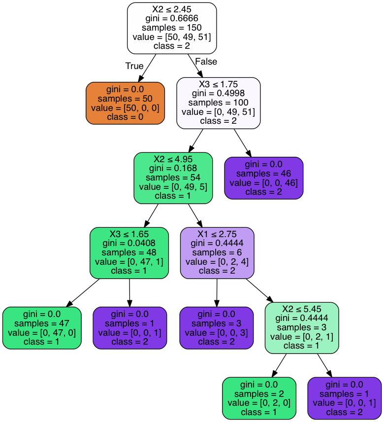

```python
# !jupyter nbconvert --to notebook --execute --output ../../_posts/2016-11-18-Describing-a-model-with-decision-trees.ipynb README.ipynb
```

    [NbConvertApp] Converting notebook README.ipynb to notebook
    [NbConvertApp] Executing notebook with kernel: python3
    [NbConvertApp] Writing 218166 bytes to ../../_posts/2016-11-18-Describing-a-model-with-decision-trees.ipynb


```python
from whatever.explanations import *
import IPython
from sklearn import datasets, discriminant_analysis
```


```python
iris = datasets.load_iris()
clf = discriminant_analysis.LinearDiscriminantAnalysis()
clf.fit(iris['data'], iris['target'])
```


    LinearDiscriminantAnalysis(n_components=None, priors=None, shrinkage=None,
                  solver='svd', store_covariance=False, tol=0.0001)


```python
description = Describer()

description.why(iris['data'], clf.predict(iris['data']))
```


<div>
<table border="1" class="dataframe">
  <thead>
    <tr style="text-align: right;">
      <th></th>
      <th>feature</th>
      <th>condition</th>
      <th>threshold</th>
    </tr>
    <tr>
      <th>class</th>
      <th></th>
      <th></th>
      <th></th>
    </tr>
  </thead>
  <tbody>
    <tr>
      <th>0</th>
      <td>2</td>
      <td>&lt;</td>
      <td>2.45</td>
    </tr>
    <tr>
      <th>1</th>
      <td>2</td>
      <td>&gt;</td>
      <td>2.45</td>
    </tr>
    <tr>
      <th>1</th>
      <td>3</td>
      <td>&lt;</td>
      <td>1.75</td>
    </tr>
    <tr>
      <th>1</th>
      <td>2</td>
      <td>&lt;</td>
      <td>4.95</td>
    </tr>
    <tr>
      <th>1</th>
      <td>3</td>
      <td>&lt;</td>
      <td>1.65</td>
    </tr>
    <tr>
      <th>2</th>
      <td>2</td>
      <td>&gt;</td>
      <td>2.45</td>
    </tr>
    <tr>
      <th>2</th>
      <td>3</td>
      <td>&gt;</td>
      <td>1.75</td>
    </tr>
  </tbody>
</table>
</div>


```python
IPython.display.Image(nx_tree(description).create_png(), embed=True)
```





```python

```
